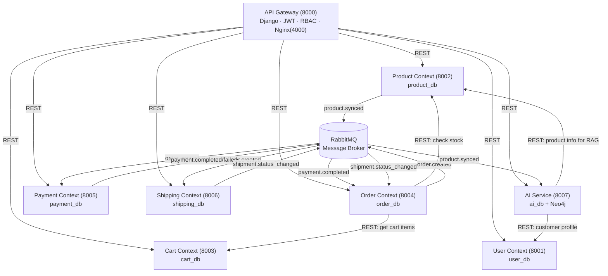

# Bounded Context Map — PyRag E-Commerce

## 1. Context Map Tổng Thể



---

## 2. Bảng Quan Hệ Giữa Các Context

| Upstream (Supplier) | Downstream (Customer) | Loại quan hệ | Pattern |
|---|---|---|---|
| User Context | Tất cả services | Customer-Supplier | JWT token chứa user_id + role |
| Product Context | Order Context | Customer-Supplier | REST API lấy price + stock |
| Product Context | AI Service | Customer-Supplier | REST + Webhook sync |
| Cart Context | Order Context | Customer-Supplier | REST API lấy cart items |
| Order Context | Payment Context | Event-Driven | RabbitMQ `order.created` |
| Order Context | Shipping Context | Event-Driven | RabbitMQ `order.created` |
| Payment Context | Order Context | Event-Driven | RabbitMQ `payment.completed/failed` |
| Shipping Context | Order Context | Event-Driven | RabbitMQ `shipment.status_changed` |

---

## 3. Ranh Giới Dữ Liệu

Mỗi context sở hữu database riêng. **Tuyệt đối không** dùng Foreign Key vật lý xuyên database. Mọi tham chiếu chéo domain chỉ lưu `id` (Soft Reference).

```
user_db       ─── user, customer_profile, address, staff_member, membership_tier ...
product_db    ─── category, product, book, electronics, fashion ..., inventory, promotions, content
cart_db       ─── cart, cart_item
order_db      ─── order, order_item, voucher, order_discount
payment_db    ─── payment, transaction_log, payment_method, gift_card
shipping_db   ─── shipment, courier, shipping_tracking
ai_db         ─── behavior_event, behavior_profile, search_history, wishlist, preference ...
              +Neo4j: User nodes, Product nodes, edges (VIEW/BUY/SIMILAR)
```

---

## 4. Quy Ước Đặt Tên

### Database Names
| Context | Database | Ghi chú |
|---|---|---|
| User | `user_db` | Rename từ `auth_db` |
| Product | `product_db` | Giữ nguyên |
| Cart | `cart_db` | Tách từ `order_db` |
| Order | `order_db` | Giữ nguyên, bỏ bảng cũ |
| Payment | `payment_db` | Tách từ `order_db` |
| Shipping | `shipping_db` | Tách từ `order_db` |
| AI | `ai_db` | Merge từ `behavior_db` + `analytics_db` |

### Port Map
| Service | Port (internal) | Port (host) |
|---|---|---|
| api_gateway | 8000 | 8000 |
| user_service | 8001 | 8001 |
| product_service | 8002 | 8002 |
| cart_service | 8003 | 8003 |
| order_service | 8004 | 8004 |
| payment_service | 8005 | 8005 |
| shipping_service | 8006 | 8006 |
| ai_service | 8007 | 8007 |
| frontend | 4000 | 4000 |

---

## 5. RabbitMQ — Event Schema

### Event: `order.created`
```json
{
  "event": "order.created",
  "order_id": 123,
  "customer_id": 456,
  "total_price": 250000,
  "payment_method": "online",
  "items": [{"product_id": 1, "quantity": 2, "price": 125000}],
  "shipping_address": "123 Abc St, HCM"
}
```

### Event: `payment.completed`
```json
{
  "event": "payment.completed",
  "order_id": 123,
  "payment_id": 789,
  "status": "SUCCESS",
  "amount": 250000
}
```

### Event: `shipment.status_changed`
```json
{
  "event": "shipment.status_changed",
  "order_id": 123,
  "shipment_id": 101,
  "new_status": "DELIVERED"
}
```

### Event: `product.synced`
```json
{
  "event": "product.synced",
  "product_id": 1,
  "name": "Sách Lập Trình Python",
  "category": "Sách",
  "price": 120000,
  "description": "..."
}
```
