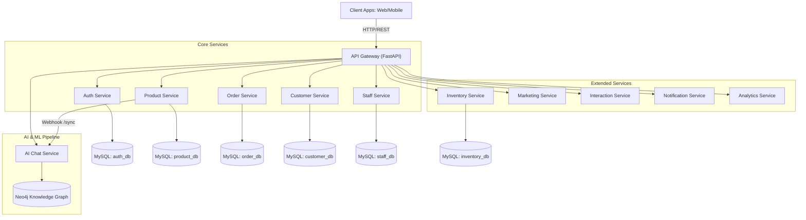
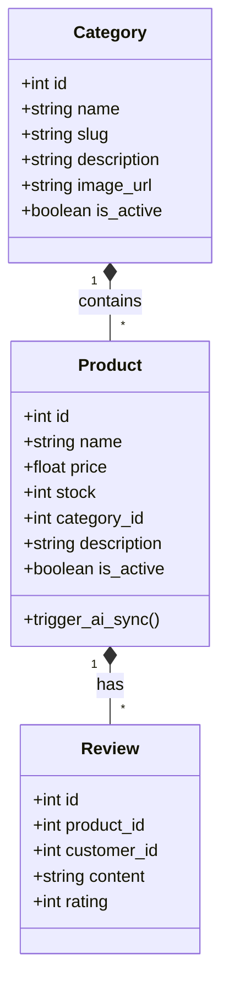
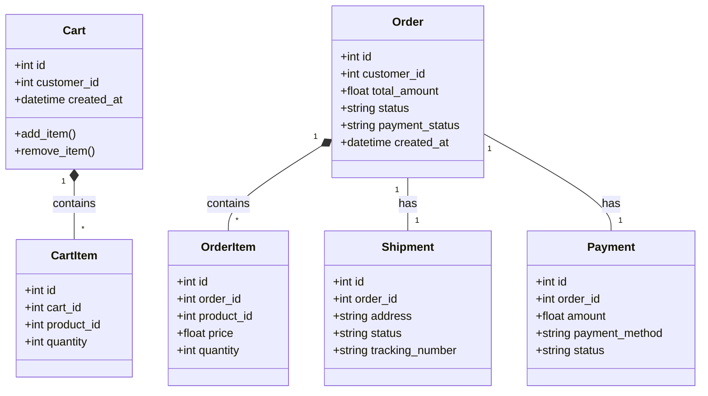
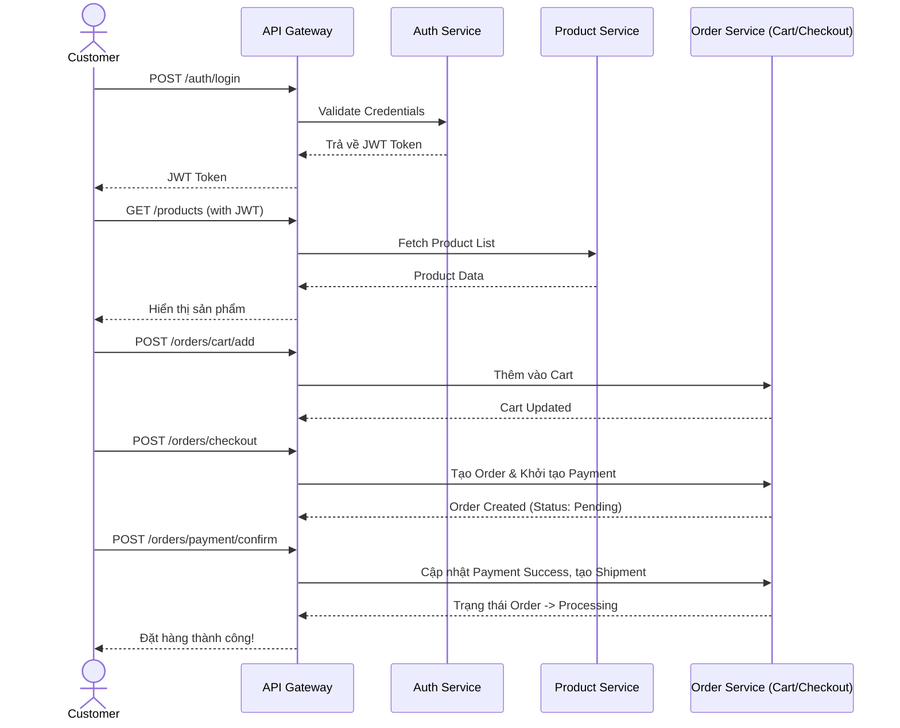

# Tài liệu hỗ trợ viết Báo cáo Tiểu luận môn SoAD

Dựa trên việc đối chiếu yêu cầu của đề bài (`tieuluan_Monhoc_KientrucThietke_PM_04-2026.md`) và mã nguồn hiện tại của hệ thống, dưới đây là những thông tin quan trọng và các sơ đồ Mermaid để bạn đưa vào báo cáo.

---

## 1. Vấn đề về API Gateway (Nginx vs FastAPI)

**Đề bài yêu cầu:** Sử dụng Nginx làm API Gateway (Mục 4.3).
**Hệ thống hiện tại:** Bạn đang sử dụng **FastAPI** (`api_gateway`) làm API Gateway.

**👉 Cách giải trình trong báo cáo (Rất ăn điểm):**
Bạn hoàn toàn có thể ghi vào báo cáo là nhóm đã nâng cấp kiến trúc. Thay vì dùng một Reverse Proxy thuần túy như Nginx, nhóm đã xây dựng một **Application-Level Gateway** bằng FastAPI. 
**Lý do (Ưu điểm so với Nginx):**
1. Cho phép lập trình các custom logic (như parse và verify JWT token trực tiếp trên code Python).
2. Dễ dàng triển khai Rate Limiting, CORS, và Circuit Breaker linh hoạt hơn.
3. Thể hiện sự hiểu biết sâu về Microservices (tương tự pattern của Spring Cloud Gateway hay Netflix Zuul).

**👉 Nếu bạn BẮT BUỘC phải bỏ Nginx vào báo cáo cho giống đề bài:**
Bạn có thể chép đoạn cấu hình Nginx mẫu này vào báo cáo (giả định Nginx đứng trước FastAPI Gateway hoặc thay thế nó):
```nginx
server {
    listen 80;
    server_name api.shopx.local;

    # Cấu hình API Gateway routing
    location /auth/ { proxy_pass http://auth_service:8001/; }
    location /products/ { proxy_pass http://product_service:8002/; }
    location /orders/ { proxy_pass http://order_service:8003/; }
    location /customers/ { proxy_pass http://customer_service:8004/; }
    location /staff/ { proxy_pass http://staff_service:8005/; }
    location /ai/ { proxy_pass http://ai_service:8007/; }
    
    # ... các service khác
}
```

---

## 2. So khớp Service hiện tại vs Đề bài (Cách giải trình)

Đề bài gợi ý: `user`, `product`, `cart`, `order`, `payment`, `shipping`.
Hệ thống của bạn có tới **14 Backend Services** chuyên sâu hơn rất nhiều! Đây là điểm cộng cực lớn vì bạn đã làm đúng theo **Domain-Driven Design (DDD)**.

**Cách viết vào báo cáo:**
- **User Service:** Bạn đã phân rã (Decomposition) sâu hơn thành `auth_service` (chuyên lo JWT/Login), `customer_service` (Profile khách hàng), và `staff_service` (Nhân sự).
- **Cart / Payment / Shipping:** Thay vì tách thành các microservice vật lý tốn chi phí rủi ro transaction (Distributed Transaction), bạn đã nhóm chúng thành các **Bounded Contexts** (apps: `cart`, `checkout`, `shipping`) nằm bên trong `order_service` để đảm bảo tính nhất quán dữ liệu (High Cohesion).
- **ĐIỂM NHẤN:** Bạn có thêm các service nâng cao như `marketing_service`, `inventory_service` (Quản lý kho), `analytics_service`, và luồng **AI RAG (`ai_service`)** rất khớp với Chương 3 của đề bài.

---

## 3. Các Sơ Đồ UML (Mermaid) dùng để vẽ lại trên Visual Paradigm

Dưới đây là các sơ đồ hệ thống thực tế dựa trên code hiện tại. Bạn copy code Mermaid này dán vào Notion hoặc [Mermaid Live](https://mermaid.live/) để xem, sau đó vẽ lại theo lên Visual Paradigm.

### 3.1. System Architecture Diagram (Kiến trúc tổng thể)
Sơ đồ này thể hiện rõ việc dùng API Gateway làm trung tâm điều phối và Database riêng cho từng service.



### 3.2. Class Diagram - Product Service
Khớp với yêu cầu mô hình hóa Sản phẩm của đề bài.



### 3.3. Class Diagram - Order Service (Gộp Cart, Payment, Shipping)
Thể hiện cách bạn gộp các Bounded Contexts vào một service.



### 3.4. Sequence Diagram - Use Case Mua Hàng & Thanh Toán
Đây là sơ đồ trình tự cho Flow end-to-end yêu cầu trong checklist đánh giá.


